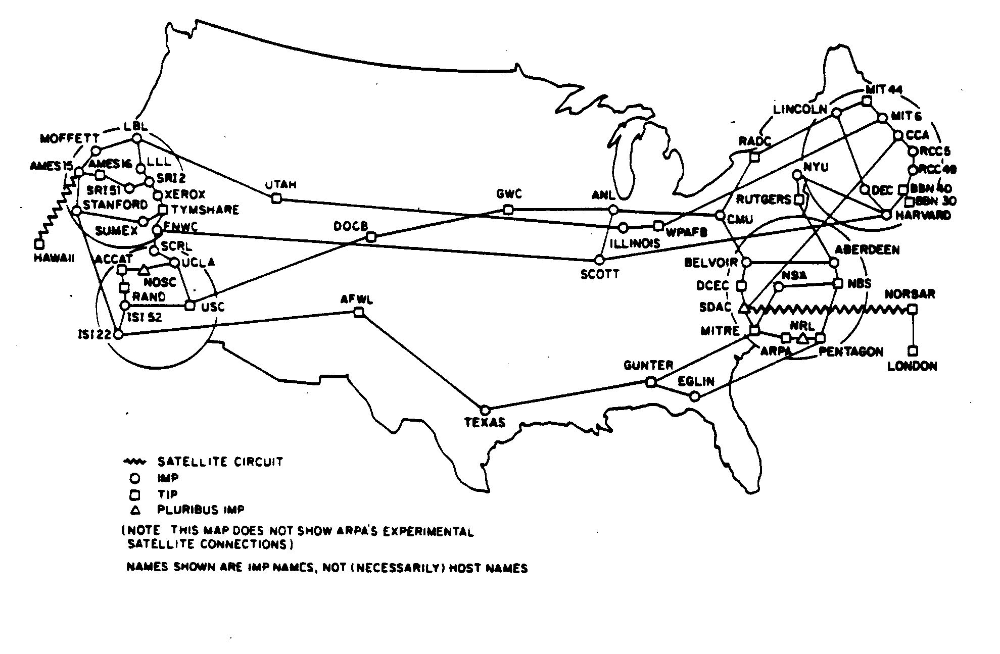

# How to talk to a browser

## intro: the internet



> ARAPNET 1970


## websites showcase

1. [https://katierosepipkin.com/#](https://katierosepipkin.com/#)

2. https://worrymetaphor.net/

3. https://eeefff.org/

4. https://www.janavirgin.com/CO2/

5. https://permacomputing.net/

6. https://squatted.online/2020/

7. https://basel.codes/2020/index.html

   

## short note on accessibility

1. [WICAG](https://www.w3.org/WAI/standards-guidelines/wcag/wcag3-intro/)
2. on [MDN](https://developer.mozilla.org/en-US/docs/Web/Accessibility/Guides/Understanding_WCAG)
3. [accessibility tool](https://wave.webaim.org/)
4. [11ty.dev](https://www.11ty.dev/docs/accessibility/) site builder with built in accessibility

## how to get help, beside using AI

* [HTML](https://developer.mozilla.org/en-US/docs/Web/HTML/Reference)
* [css](https://developer.mozilla.org/en-US/docs/Web/CSS/Reference/Properties)
* https://developer.mozilla.org/en-US/docs/Web/CSS/Reference/Properties/cursor
* https://css-tricks.com/snippets/css/a-guide-to-flexbox/
* [Animations](https://developer.mozilla.org/en-US/docs/Web/CSS/Guides/Animations/Using)


## Class output

```html
<!DOCTYPE html>
<html lang="en">
<head>


    <meta charset="UTF-8">
    <meta name="viewport" content="width=device-width, initial-scale=1.0">
    <title>funky garden 🪼 fn + E </title>

    <style>
        body{
            background-color: rgb(129, 173, 90);
            background-image: url(images/giphy-02.gif);
            background-size: 50%;
            color: red;
        }

        .container{
            position: absolute;
            float: left;
            left: 100px;
            top: 200px;
            width: 300px;
            height: 500px;
            background-color: white;
            color: blue;
        }

        .green-title{
            color: chartreuse;
            text-shadow: black 0px 0px 10px;
            transition: all 1s;
        }

        .green-title:hover{
            color: black;
            font-size: 200px;
        }

        img{
            width: 60%;
        }

    </style>


</head>
<body>
    <div class="container">
        <h1 class="green-title">Funky Garden</h1>
        <h2 class="green-title">sub title</h2>
        <p>
            my best essay is written here.
            ...
        </p>
        
    </div>
    <video controls src=""></video>

</body>
</html>


```


## Boiler plates

## index.html

```html
<!doctype html>
<html lang="en">
  <head>
    <meta charset="UTF-8" />
    <meta name="viewport" content="width=device-width, initial-scale=1.0" />
    <title>funky website</title>
  </head>
  <body>
    <h1>I am a title</h1>
    <h2>I am a sub title</h2>
    <h3>even smaller title</h3>

    <p>
      I am a paragraph Lorem ipsum dolor sit amet consectetur adipisicing elit.
      Omnis, in. Atque veniam quos aliquid quam odit, aspernatur corporis
      mollitia eveniet quod possimus libero maxime. Possimus quas corporis quos
      consequatur hic.
    </p>

    <div>
      I am a
      <p>container</p>
      <a href="https://coolwebsitethatdoesnotexist.com"
        >of different things like a link</a
      >
    </div>
  </body>
</html>

```

## style.css

```css
/* position */
/* this you may want to apply to containers aka divs */

.somewhere{
  position: absolute;
  left: 20px;
  top: 100px;
  width: 300px; /* try with % instead of 'px'*/
  height: 300px; /* same with potatoes */
  background-color: red; /* try other names or use hex values (#f00 [red])*/
  /*the following will override the color*/
  background-image: url('path/to/your/image.png');
  /* the follwing are used to finetune the image*/
  /* check examples here https://developer.mozilla.org/en-US/docs/Web/CSS/Reference/Properties/background-size*/
  background-origin:;
	background-position:;
	background-position-x:;
	background-position-y:;
	background-repeat:;
	background-repeat-x:;
	background-repeat-y:;
	background-size:;
  /* give depth to your web page with shadows*/
  box-shadow:black 3px 3px 20px;
}

.text{
  font-size:;
  font-family: "MyCursedFont", serif;
  /* or se the built in fonts */
}

/* load your preferred font */
/* https://developer.mozilla.org/en-US/docs/Web/CSS/Reference/At-rules/@font-face */
@font-face {
  font-family: 'MyCursedFont';
  src: url('/path/to/your/font.woff2') format('woff2'),
    url('/path/to/your/font.woff') format('woff'),
  font-weight: normal;
  font-style: italic;
  font-display: swap;
}

/*emoji cursor*/

html {
  cursor: url("data:image/svg+xml;utf8,<svg xmlns='http://www.w3.org/2000/svg' width='40' height='48' viewport='0 0 100 100' style='fill:black;font-size:24px;'><text y='50%'>🪱</text></svg>") 14 16, auto;
}


```


## CSS Help

1. [Animations](https://developer.mozilla.org/en-US/docs/Web/CSS/Guides/Animations/Using)


### Secret (not anymore) font repository for retro style websites

https://int10h.org/oldschool-pc-fonts/


